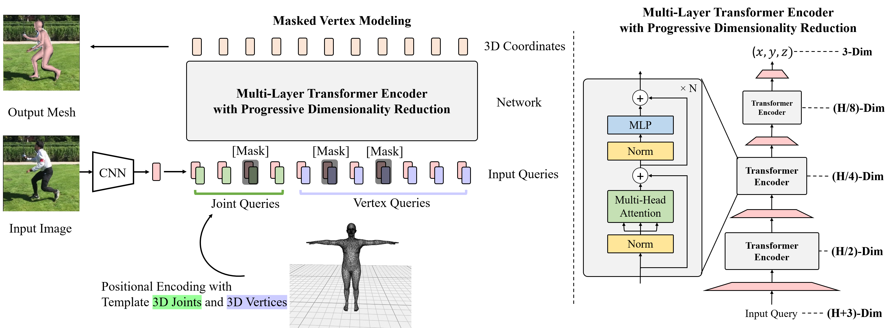

# MeshTransformer ✨

This is our research code of [End-to-End Human Pose and Mesh Reconstruction with Transformers](https://arxiv.org/abs/2012.09760). 

MEsh TRansfOrmer is a simple yet effective transformer-based method for human pose and mesh reconsruction from an input image. In this repository, we provide our research code for training and testing our proposed method for the following tasks:

- Human pose and mesh reconstruction
- Hand pose and mesh reconstruction

  


    


## Installation
Check [INSTALL.md](docs/INSTALL.md) for installation instructions.

## Model Zoo and Download
Please download our pre-trained models and other relevant files that are important to run our code. 

Check [DOWNLOAD.md](docs/DOWNLOAD.md) for details. 


## Quick demo
We provide demo codes to run end-to-end inference on the test images.

Check [DEMO.md](docs/DEMO.md) for details.


## Experiments
We provide python codes for training and evaluation.

Check [EXP.md](docs/EXP.md) for details.

## Contributing 

We welcome contributions and suggestions. Please check [CONTRIBUTE](docs/CONTRIBUTE.md) and [CODE_OF_CONDUCT](docs/CODE_OF_CONDUCT.md) for details. 


## Citations
If you find our work useful in your research, please consider citing:

```bibtex
@inproceedings{lin2021end-to-end,
author = {Lin, Kevin and Wang, Lijuan and Liu, Zicheng},
title = {End-to-End Human Pose and Mesh Reconstruction with Transformers},
booktitle = {CVPR},
year = {2021},
}
```


## License

Our research code is released under the MIT license. See [LICENSE](LICENSE) for details. 

We use submodules from third parties, such as [huggingface/transformers](https://github.com/huggingface/transformers) and [hassony2/manopth](https://github.com/hassony2/manopth). Please see [NOTICE](NOTICE.md) for details. 

We note that any use of SMPL models and MANO models are subject to **Software Copyright License for non-commercial scientific research purposes**. See [SMPL-Model License](https://smpl.is.tue.mpg.de/modellicense) and [MANO License](https://mano.is.tue.mpg.de/license) for details.


## Acknowledgments

Our implementation and experiments are built on top of open-source GitHub repositories. We thank all the authors who made their code public, which tremendously accelerates our project progress. If you find these works helpful, please consider citing them as well.

[huggingface/transformers](https://github.com/huggingface/transformers) 

[HRNet/HRNet-Image-Classification](https://github.com/HRNet/HRNet-Image-Classification) 

[nkolot/GraphCMR](https://github.com/nkolot/GraphCMR) 

[akanazawa/hmr](https://github.com/akanazawa/hmr) 

[MandyMo/pytorch_HMR](https://github.com/MandyMo/pytorch_HMR) 

[hassony2/manopth](https://github.com/hassony2/manopth) 

[hongsukchoi/Pose2Mesh_RELEASE](https://github.com/hongsukchoi/Pose2Mesh_RELEASE) 

[mks0601/I2L-MeshNet_RELEASE](https://github.com/mks0601/I2L-MeshNet_RELEASE) 

[open-mmlab/mmdetection](https://github.com/open-mmlab/mmdetection) 


